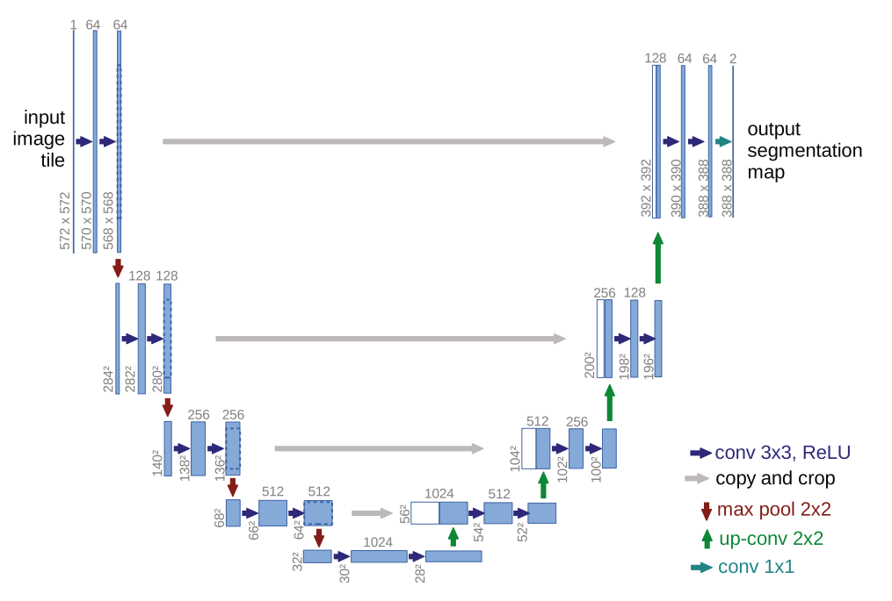
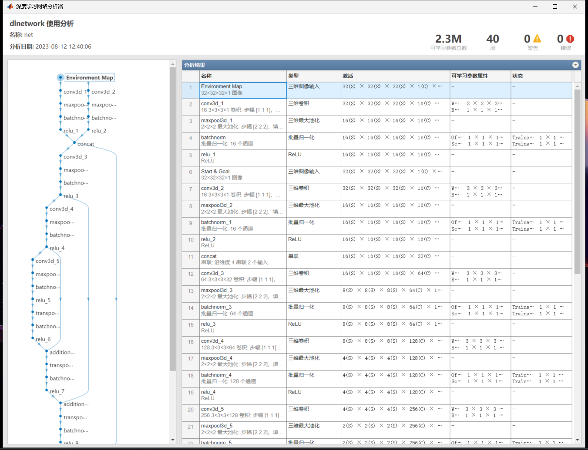
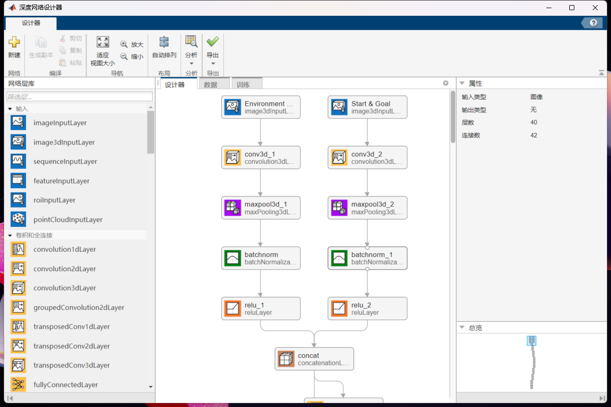
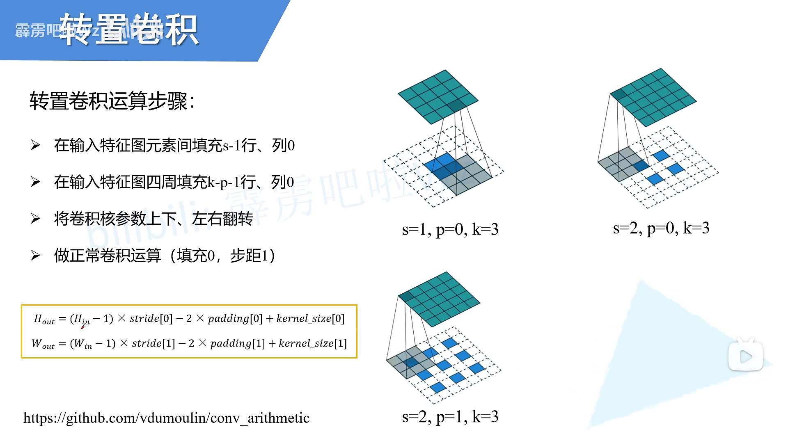

# 1 介绍
本项目旨在复现论文[Deep Neural Network Enhanced Sampling-Based Path Planning in 3D Space](https://ieeexplore.ieee.org/abstract/document/9598184)的核心算法（网络模型采用文中的3D DNN Models），目前网络模型部分未能复现，所遇问题将在下文阐述。
# 2 环境配置
## 2.1 最佳环境配置（大概率可向前兼容）
- MATLAB版本2023a
- python版本3.8，torch版本1.13.1+cu116，torchvision版本0.14.1+cu116，d2l版本0.17.6
## 2.2 环境配置过程
### 2.2.1 python环境配置
#### 1 李沐《动手学深度学习》资源
- [官方网站](https://d2l.ai)
- [官方视频](https://www.bilibili.com/video/BV1if4y147hS)
#### 2 Anaconda环境配置
- [下载Anaconda](https://www.anaconda.com)，安装时勾选“添加到环境变量”
- 打开Anaconda Prompt
- 创建虚拟环境：`conda create -n d2l python=3.8`（现以python3.8版本为例）
- 激活虚拟环境：`conda activate d2l`
- 安装d2l库：`pip install jupyter d2l -i https://pypi.tuna.tsinghua.edu.cn/simple`
#### 3 CUDA环境配置
- 打开NVIDIA控制面板，点击“帮助”→“系统信息”→“组件”→3D设置第3行NVCUDA64.DLL项，查看最大支持CUDA版本，现以CUDA版本11.6为例。
- [下载CUDA](https://developer.nvidia.com/cuda-11-6-0-download-archive)，安装时请参考[视频链接](https://www.bilibili.com/video/BV1nL4y1b7oT/)，注意对于高版本更新到低版本的选项不要勾选，安装失败时请参考[博客链接](https://blog.csdn.net/Redamancy06/article/details/125760678)，尤其需要取消勾选Hsight VSE。
- [下载cuDNN](https://developer.nvidia.cn/rdp/cudnn-download)，注意下载前需要注册NVIDIA开发者账户。
- [下载pytorch和torchvision](https://download.pytorch.org/whl/torch_stable.html)并安装，版本：cu116/torch-1.13.1%2Bcu116-cp38-cp38-win_amd64.whl，cu116/torchvision-0.14.1%2Bcu116-cp38-cp38-win_amd64.whl。安装：
```
conda activate d2l
pip install “路径名/torch-1.13.1%2Bcu116-cp38-cp38-win_amd64.whl”
pip install “路径名/torchvision-0.14.1%2Bcu116-cp38-cp38-win_amd64.whl”
```
#### 4 pycharm环境配置
- [下载pycharm <u>Community</u>版本](https://www.jetbrains.com/pycharm/download/?section=windows)并安装。
- 在pycharm中创建新项目，更改项目的python解释器为conda虚拟环境d2l，参考[博客链接](https://blog.csdn.net/weixin_42009054/article/details/100144417)。
- 更改pycharm的终端为Anaconda Prompt,参考[博客链接](https://blog.csdn.net/jialong_chen/article/details/122092510)。
#### 5 验证环境
- 输入：
```
import torch 
import torchvision 
print(torch.__version__) 
print(torchvision.__version__) 
print(torch.cuda.is_available())
```
- 输出：
```
1.13.1+cu116
0.14.1+cu116
True
```
6 使用Jupyter阅读程序
在[官方网站](https://d2l.ai)点击“Jupyter记事本”下载资源，在资源目录下执行：
```
conda activate d2l
Jupyter Notebook
```
### 2.2.2 MATLAB与pytorch交互
- [官方视频](https://www.bilibili.com/video/BV1WY4y17728)介绍了3种Matlab与TesnorFlow/Pytorch框架交互的方法
- 本项目参考[知乎链接](https://zhuanlan.zhihu.com/p/536858806)实现了从MATLAB调用在Pytorch中预训练好的网络模型，属于[官方视频](https://www.bilibili.com/video/BV1WY4y17728)中提到的第一种方法“Co-execution between MATLAB and TensorFlow/Pytorch”。
# 3 算法流程摘要
算法流程总体来说可以划分为3部分：
- 数据集构建
- 网络模型构建
- 3D Neural RRT*算法路径规划
## 3.1 数据集构建
根据原论文，网络的2个输入和1个输出均为1通道32\*32\*32数据。其中，元素的值的设置不明，猜测在[0,1]区间，基于此，设：

第1个输入**X1**为障碍地图矩阵(0代表无障碍，1代表障碍）。<br>
第2个输入**X2**为包含起始点与终点位置的矩阵(0代表其他区域，1代表以起点和终点为中心3\*3\*3的区域)。<br>
输出**Y**为promising region(有前景的区域)的原始矩阵，矩阵中满足一定值的元素代表promising region。<br>
网络的训练目标**T**以由A*算法生成的拓宽路径作为promising region（0代表其他区域，1代表拓宽路径上的区域）。

因此，单个数据样本可以表示为[**X1**,**X2**,**T**]
### 3.1.1 生成第一个输入**X1**
初始化32\*32\*32全0地图矩阵，随机生成若干个长方体障碍，长方体内对应位置的元素值设为1，可得到**X1**。
### 3.1.2 生成第二个输入**X2**
初始化32\*32\*32全0地图矩阵，根据**X1**在无障碍区域采样起点和终点，再将以起点和终点为中心3\*3\*3区域对应元素的值设为1（采样时需要保证起点和终点周围3\*3\*3区域也不存在障碍），得到**X2**。
### 3.1.3 生成目标**T**
初始化32\*32\*32全0地图矩阵，根据**X1**和构建**X2**时得到的起点和终点，执行A*算法进行路径规划，并拓宽所得路径，将拓宽路径区域对应的元素值设为1，得到**T**。

需要注意的是，A*算法的输入地图是由**X1**转化得到的栅格地图（MATLAB中的ocuupancyMap3D），并经过一定程度的膨胀（具体膨胀程度取决于无人机的半径）。

### 3.1.4 数据的组织

设生成的数据样本数量为n，则首先需要将n个单个数据样本[**X1**,**X2**,**T**]组织为n行3列的Cell结构，保存为.mat文件。下面不再将[**X1**,**X2**,**T**]视作单个数据样本，而是视为一个批量的数据。
#### 1 MATLAB中的组织
通过下列代码将数据转化为MATLAB神经网络工具箱中定义批量数据所需的组织方式：
```
function ds = loadData(name)
% 将路径name中的.mat文件转为TransformDataStore类型（这样才能传入MATLAB的神经网络）
    fds = fileDatastore(name,ReadFcn=@load);
    ds = transform(fds,@transformFcn);
end

function dsNew = transformFcn(ds1)
    dsNew = ds1.dataCell;
end
```

如下是批量数据的一种定义方式：
```
mbq = minibatchqueue(ds,...
MiniBatchSize=miniBatchSize, ...
MiniBatchFcn=@preprocessMiniBatch, ...
MiniBatchFormat="SSSCB");
```

通过```[X1,X2,T] = next(mbq);```可以将一个批量的数据取出，以输入到网络模型进行训练与预测。

#### 2 pytorch中的组织
首先自定义一个2输入1输出的dataloader类型:
```
class MyDataset(Dataset):
    """
    自定义2输入1输出的dataloader类型
    """
    def __init__(self, data):
        self.data = data

    def __len__(self):
        return len(self.data)

    def __getitem__(self, index):
        input1, input2, output = self.data[index]
        return torch.Tensor(input1), torch.Tensor(input2), torch.Tensor(output)
```

再读取保存好的数据集.mat文件作为输入以创建dataloader供pytorch的网络进行训练:

```
def load_data(batch_size,dataloader_workers=0):
    """
    从.mat文件中加载数据，转为dataloader类型
    """
    mat_train = scipy.io.loadmat('../trainData.mat')
    mat_test = scipy.io.loadmat('../testData.mat')
    mat_train = mat_train['dataCell']
    mat_test = mat_test['dataCell']
    data_train = MyDataset(mat_train)
    data_test = MyDataset(mat_test)
    return (DataLoader(data_train,batch_size,shuffle=True,num_workers=dataloader_workers),
            DataLoader(data_test,batch_size,shuffle=True,num_workers=dataloader_workers))
```

对于预测，需要注意的是在进行数据类型转换后还需要转换数据批量的维度的排列方式,即由SSSCB（数据维、数据维、数据维、通道维、批量维）转为BCSSS，返回预测输出也同理，此操作可在python中完成：
```
X1 = np.asarray(X1)
X1 = torch.from_numpy(X1)
X1 = X1.type(torch.FloatTensor)
X1 = torch.Tensor(X1).permute(4, 3, 0, 1, 2)
# ...
```
```
with torch.no_grad():
    pred = model(X1,X2)
pred = torch.Tensor(pred).permute(2, 3, 4, 1, 0)
pred = pred.detach().numpy()
pred = np.ascontiguousarray(pred)
```

## 3.2 网络模型构建
拟复现原论文中提到的3D CNN Model:

其构造源自[U-net: Convolutional networks for biomedical image segmentation](https://link.springer.com/chapter/10.1007/978-3-319-24574-4_28):

根据原论文中的描述，其在U-net的decoder和encoder部分都应用了4层3\*3\*3的卷积层，然而这些信息并不足以构造一个具体的网络架构，并且，本项目在根据U-net尝试构造具体的网络架构时，发现并不能同时满足原论文当中的所有描述。

### 3.2.1 网络模型的生成步骤
#### 1 在MATLAB中生成网络模型
在MATLAB中，生成网络模型较为方便的方法是在深度网络设计器中将所有的层进行参数设置并连接好后直接导出网络模型，网络模型以.net文件的形式保存。接着，将网络模型和数据集输入到训练循环中，通过训练以更新网络模型中的参数，得到训练好的网络。自定义训练循环请参考[Train Network Using Custom Training Loop](https://ww2.mathworks.cn/help/deeplearning/ug/train-network-using-custom-training-loop.html)。
#### 2 在pytorch中生成网络模型
在pytorch中，可以根据待构造网络模型的特点对其进行分块，并定义成不同的类，最后在总的网络结构中包含这些类的实例：
```
class MyConv3dBlock(nn.Module):
    """
    encoder路径的卷积块
    """
    def __init__(self, input_channels, num_channels):
        super().__init__()
        self.conv = nn.Conv3d(in_channels=input_channels,
                              out_channels=num_channels,
                              kernel_size=(3, 3, 3),
                              stride=(1, 1, 1),
                              padding =(1, 1, 1))
        self.mp = nn.MaxPool3d(kernel_size=(2, 2, 2),
                               stride=(2, 2, 2))
        self.bn = nn.BatchNorm3d(num_channels)
        self.rl = nn.ReLU()

    def forward(self, X):
        Y = self.rl(self.bn(self.mp(self.conv(X))))
        return Y


class MyConvTransPose3dBlock(nn.Module):
    """
    decoder路径的转置卷积块
    """
    def __init__(self, input_channels, num_channels):
        super().__init__()
        self.tpconv = nn.ConvTranspose3d(in_channels=input_channels,
                                         out_channels=num_channels,
                                         kernel_size=(2, 2, 2), # origin paper论文是3*3*3，但如此无法满足输出大小恰好翻倍
                                         stride=(2, 2, 2),
                                         padding=(0, 0, 0))
        self.bn = nn.BatchNorm3d(num_channels)
        self.rl = nn.ReLU()

    def forward(self, X):
        Y = self.rl(self.bn(self.tpconv(X)))
        return Y


class MyUnet(nn.Module):
    """
    查看网络架构：
    net = MyUnet()
    net = net.to("cuda")
    summary(net,[(1,32,32,32),(1,32,32,32)])
    """
    def __init__(self):

        # encoder
        super().__init__()
        self.my_conv3d1a = MyConv3dBlock(1,16)
        self.my_conv3d1b = MyConv3dBlock(1,16)
        self.my_conv3d2 = MyConv3dBlock(32,64)
        self.my_conv3d3 = MyConv3dBlock(64,128)
        self.my_conv3d4 = MyConv3dBlock(128,256)

        # decoder
        self.my_tpconv3d1 = MyConvTransPose3dBlock(256,128)
        self.my_tpconv3d2 = MyConvTransPose3dBlock(128,64)
        self.my_tpconv3d3 = MyConvTransPose3dBlock(64, 32)
        self.my_tpconv3d4 = MyConvTransPose3dBlock(32, 16)
        self.conv1x1 = nn.Conv3d(16, 1, kernel_size=(1,1,1), stride=(1,1,1), padding=(0,0,0))
        self.sig = nn.Sigmoid()


    def forward(self, x1, x2):
        # encoder
        out1a = self.my_conv3d1a(x1)
        out1b = self.my_conv3d1b(x2)
        out1ab = torch.cat([out1a, out1b], dim=1)
        out2 = self.my_conv3d2(out1ab)
        out3 = self.my_conv3d3(out2)
        out4 = self.my_conv3d4(out3)

        # decoder
        out5 = self.my_tpconv3d1(out4)
        out6 = self.my_tpconv3d2(out5 + out3)
        out7 = self.my_tpconv3d3(out6 + out2)
        out8 = self.my_tpconv3d4(out7 + out1ab)
        out9 = self.conv1x1(out8)
        out10 = self.sig(out9)

        return out10

```
类似地，将网络模型和数据集输入到训练循环中，得到训练好的网络。pytorch中的自定义训练循环可参考d2l库的```d2l.train_ch6()```函数。

### 3.2.2 网络结构查看
#### 1 在MATLAB中查看网络结构
在MATLAB中，可通过```analyzeNetwork()```输入网络的dlnetwork类型查看网络结构：

也可以通过在深度网络设计器中导入网络的lgraph类型查看网络结构：


#### 2 在pytorch中查看网络结构
在pytorch中，可通过```torchsummary.summary()``结合输入数据大小来查看网络的结构:
```
net = MyUnet()
net = net.to("cuda")
summary(net,[(1,32,32,32),(1,32,32,32)])
```
输出如下：
```
----------------------------------------------------------------
        Layer (type)               Output Shape         Param #
================================================================
            Conv3d-1       [-1, 16, 32, 32, 32]             448
         MaxPool3d-2       [-1, 16, 16, 16, 16]               0
       BatchNorm3d-3       [-1, 16, 16, 16, 16]              32
              ReLU-4       [-1, 16, 16, 16, 16]               0
     MyConv3dBlock-5       [-1, 16, 16, 16, 16]               0
            Conv3d-6       [-1, 16, 32, 32, 32]             448
         MaxPool3d-7       [-1, 16, 16, 16, 16]               0
       BatchNorm3d-8       [-1, 16, 16, 16, 16]              32
              ReLU-9       [-1, 16, 16, 16, 16]               0
    MyConv3dBlock-10       [-1, 16, 16, 16, 16]               0
           Conv3d-11       [-1, 64, 16, 16, 16]          55,360
        MaxPool3d-12          [-1, 64, 8, 8, 8]               0
      BatchNorm3d-13          [-1, 64, 8, 8, 8]             128
             ReLU-14          [-1, 64, 8, 8, 8]               0
    MyConv3dBlock-15          [-1, 64, 8, 8, 8]               0
           Conv3d-16         [-1, 128, 8, 8, 8]         221,312
        MaxPool3d-17         [-1, 128, 4, 4, 4]               0
      BatchNorm3d-18         [-1, 128, 4, 4, 4]             256
             ReLU-19         [-1, 128, 4, 4, 4]               0
    MyConv3dBlock-20         [-1, 128, 4, 4, 4]               0
           Conv3d-21         [-1, 256, 4, 4, 4]         884,992
        MaxPool3d-22         [-1, 256, 2, 2, 2]               0
      BatchNorm3d-23         [-1, 256, 2, 2, 2]             512
             ReLU-24         [-1, 256, 2, 2, 2]               0
    MyConv3dBlock-25         [-1, 256, 2, 2, 2]               0
  ConvTranspose3d-26         [-1, 128, 4, 4, 4]         262,272
      BatchNorm3d-27         [-1, 128, 4, 4, 4]             256
             ReLU-28         [-1, 128, 4, 4, 4]               0
MyConvTransPose3dBlock-29         [-1, 128, 4, 4, 4]               0
  ConvTranspose3d-30          [-1, 64, 8, 8, 8]          65,600
      BatchNorm3d-31          [-1, 64, 8, 8, 8]             128
             ReLU-32          [-1, 64, 8, 8, 8]               0
MyConvTransPose3dBlock-33          [-1, 64, 8, 8, 8]               0
  ConvTranspose3d-34       [-1, 32, 16, 16, 16]          16,416
      BatchNorm3d-35       [-1, 32, 16, 16, 16]              64
             ReLU-36       [-1, 32, 16, 16, 16]               0
MyConvTransPose3dBlock-37       [-1, 32, 16, 16, 16]               0
  ConvTranspose3d-38       [-1, 16, 32, 32, 32]           4,112
      BatchNorm3d-39       [-1, 16, 32, 32, 32]              32
             ReLU-40       [-1, 16, 32, 32, 32]               0
MyConvTransPose3dBlock-41       [-1, 16, 32, 32, 32]               0
           Conv3d-42        [-1, 1, 32, 32, 32]              17
          Sigmoid-43        [-1, 1, 32, 32, 32]               0
================================================================
Total params: 1,512,417
Trainable params: 1,512,417
Non-trainable params: 0
----------------------------------------------------------------
Input size (MB): 4096.00
Forward/backward pass size (MB): 37.69
Params size (MB): 5.77
Estimated Total Size (MB): 4139.46
----------------------------------------------------------------
```

### 3.2.3 3D CNN model的块
本项目所构造的3D CNN model具体网络架构主要完善了原论文中未提及的3D CNN model的块的细节，其余部分与原论文基本一致。
#### 1 decoder块
本项目所构造的具体网络架构在decoder部分的一个块包括3\*3\*3卷积层、最大池化层、批量归一化层、Relu层：
```
tempLayers = [
    convolution3dLayer([3 3 3],64,"Name","conv3d_3","Padding",[1 1 1;1 1 1],"WeightsInitializer","he")
    maxPooling3dLayer([2 2 2],"Name","maxpool3d_3","Padding","same","Stride",[2 2 2])
    batchNormalizationLayer("Name","batchnorm_3")
    reluLayer("Name","relu_3")];
```
```
class MyConv3dBlock(nn.Module):
    """
    encoder路径的卷积块
    """
    def __init__(self, input_channels, num_channels):
        super().__init__()
        self.conv = nn.Conv3d(in_channels=input_channels,
                              out_channels=num_channels,
                              kernel_size=(3, 3, 3),
                              stride=(1, 1, 1),
                              padding =(1, 1, 1))
        self.mp = nn.MaxPool3d(kernel_size=(2, 2, 2),
                               stride=(2, 2, 2))
        self.bn = nn.BatchNorm3d(num_channels)
        self.rl = nn.ReLU()

    def forward(self, X):
        Y = self.rl(self.bn(self.mp(self.conv(X))))
        return Y
```
#### 2 encoder块
encoder部分的一个块包括转置卷积层、批量归一化层、Relu层：
```
tempLayers = [
    additionLayer(2,"Name","addition_1")
    transposedConv3dLayer([3 3 3],64,"Name","transposed-conv3d_1","Cropping","same","Stride",[2 2 2])
    batchNormalizationLayer("Name","batchnorm_7")
    reluLayer("Name","relu_7")];
lgraph = addLayers(lgraph,tempLayers);
```
```
class MyConvTransPose3dBlock(nn.Module):
    """
    decoder路径的转置卷积块
    """
    def __init__(self, input_channels, num_channels):
        super().__init__()
        # 原论文的kernel_size是3*3*3，但如此无法满足输出大小恰好翻倍
        self.tpconv = nn.ConvTranspose3d(in_channels=input_channels,
                                         out_channels=num_channels,
                                         kernel_size=(2, 2, 2), 
                                         stride=(2, 2, 2),
                                         padding=(0, 0, 0))
        self.bn = nn.BatchNorm3d(num_channels)
        self.rl = nn.ReLU()

    def forward(self, X):
        Y = self.rl(self.bn(self.tpconv(X)))
        return Y
```

也许是由于MATLAB与pytorch中API差异，MATLAB中的转置卷积可设置为3\*3\*3大小，而pytorch中的转置卷积只能设置为2\*2\*2大小才能满足数据大小从输入到输出的变化，pytorch中3D转置卷积层```nn.ConvTranspose3d()```的参数```kernel_size```、```stride```、```padding```对输出大小的影响如下：


### 3.2.4 损失函数
原论文中的损失函数使用了二元交叉熵的均值，即将目标和输出对应位置的所有值对(value-pair)取二元交叉熵后再取均值，然而MATLAB中无此损失函数，故简单用交叉熵函数```crossentropy();```作为替代，但该函数将数据的其中一维作为标签，主要用于做图像分类预测，不符合我们的要求。pytorch中则存在此损失函数```nn.BCELoss()```。

## 3.3 3D Neural RRT*算法路径规划
原论文中的3D Neural RRT\*与原始RRT\*算法的区别仅在于采样步骤。原始RRT\*算法在采样时有0.5的概率在整个构型空间中进行均匀采样，另外0.5的概率以目标点作为采样点；3D Neural RRT\*将以目标点作为采样点替换为以promising的非均匀采样，并在找到路径前后设置不同的阈值以适应对搜索和收敛的需求：
```
function samplePoint = sample_point(mapSize,goalNode,promisingRegion,hadfoundFeisiblePath)
    mu1 = 0.9; mu2 = 0.5;
    mu = mu1;
    if hadfoundFeisiblePath
        mu = mu2;
    end
    if rand() < mu                              % 非均匀采样
        idx = randi([1,promisingRegion.Count]);
        samplePoint = promisingRegion.Location(idx,:);
    else                                        % 均匀采样
        samplePoint = rand(1,3).*mapSize;
        % % % 标准RRT/RRT*算法中有分配一定概率取目标点作为采样点的机制，即：
        % % if rand() < 0.5
        % %     samplePoint = rand(1,3).*mapSize;
        % % else
        % %     samplePoint = goalNode.pos;
        % % end
    end
end
```
相比原始RRT\*算法，3D Neural RRT\*的输入也只是多出promising region这一输入：
```
function [path,nodeList] = RRTstar(map,mapSize,startPos,goalPos,iterMax,step,promisingRegion)
% 输入：map为占据栅格地图，mapSize为地图尺寸大小，startPos为起点，goalPos为目标点
%      iterMax为最大迭代次数，step为迭代步长，promisingRegion为期望区域
    str = initParam("RRTstar");
    visualization = str.visualization;

    startNode = RRTnode(startPos,nan,1); 
    goalNode = RRTnode(goalPos,nan,nan);
    nodeList = startNode;
    hadfoundFeisiblePath = false;
    path = [];

    pathLineHandles = [];
    treeLineHandles = [];

    for i=1:iterMax
        disp("Current Iterations:"+i);
        samplePoint = sample_point(mapSize,goalNode,promisingRegion,hadfoundFeisiblePath);
        nearestNode = find_nearest_node(nodeList,samplePoint);
        newNode = generate_new_node(step,samplePoint,nearestNode);
        nearNodes = find_near_nodes(step*2,nodeList,newNode);
        sortedNearNodes = sort_near_nodes_bycost(nodeList,newNode,nearNodes);
        fatherNode = pick_father_node(map,newNode,sortedNearNodes);
        if isempty(fatherNode) == false
            [nodeList,newNode] = add_new_node(nodeList,newNode,fatherNode);
            nodeList = rewrite(map,nodeList,newNode,sortedNearNodes);
            if hadfoundFeisiblePath == false
                isfoundFeisiblePath = foundedpath_judge(map,goalNode,step,newNode);
            end
            if isfoundFeisiblePath
                if hadfoundFeisiblePath == false
                    [nodeList,goalNode] = add_new_node(nodeList,goalNode,newNode);
                    hadfoundFeisiblePath = true;
                else
                    path = get_path(nodeList,goalNode);
                    pathLineHandles = show_path(path,pathLineHandles,visualization);
                end
            end
        end
        treeLineHandles = show_nodeList(nodeList,treeLineHandles,visualization);
    end
end
```
# 4 实现所遇问题
实现过程当中所遇到的问题主要是网络模型的输出不符合预期，无论如何设定阈值，所得promising region都不能像原论文中那样是一个介于起点与目标点之间的封闭区域。当设定阈值为0.2，将输出Y中大于0.2的值所对应位置的集合视作promising region，可以发现所得promising region主要集中在起点和终点，并且非常离散：

由此认定网络模型并没有得到良好训练。

此问题的出现可能由以下因素导致：
#### 1 数据的值的设置不恰当
原论文中并未提及输入数据中代表不同状态的元素的值如何设置，因此本项目如[3.1](#31-数据集构建)节中所述置值。
#### 2 网络结构有误或网络层参数设置有误
原论文中对网络结构的描述非常不明确，根据其描述并不能唯一确定一个具体的网络架构，因此本项目如[3.2](#32-网络模型构建)节中所述构造网络架构。所有可能与原论文意思不同的地方包括块的设计和上采样（转置卷积）的设计。
#### 3 损失函数不正确
原论文中所用的损失函数应为二元交叉熵，如[3.2.4](#324-损失函数)所述。现在可以肯定MATLAB中的损失函数不符合原论文中的损失函数，但pytorch中的损失函数应该是正确的。
#### 4 训练参数设置不当
本项目已经按照U-net的训练方法对训练参数进行初始化，如对卷积层的权重执行何凯明初始化、使用SGDM进行优化等。

除网络模型的输出不符合预期外，本项目还没有实现将生成的训练数据映射至32\*32\*32的输入和目标，即原论文中所提及的对于其他（较大）尺寸的输入地图，将其压缩至32\*32\*32再输入到网络模型中进行训练。

此外，作为路径规划算法，算法的高效性需要的以保证。然而本项目仅是进行初步的算法复现，代码中的许多地方都没有进行优化，尤其是A\*算法和3D Nerual RRT\*算法内部还有许多重复冗余。